# 👋 Hola, soy Jordie

### 🚀 Estudiante de Ingeniería de Sistemas | Full Stack Developer

Soy un apasionado por la tecnología y el desarrollo de software. Me especializo en construir aplicaciones web escalables y eficientes, combinando potentes backends con interfaces modernas. Siempre estoy aprendiendo nuevas tecnologías y arquitecturas.

---

### 🛠️ Tech Stack

**Frontend & Diseño**
 

**Backend**
 

**Bases de Datos & Cloud**
 

**DevOps & Herramientas**
 

---

### 📊 Mis Estadísticas (GitHub Metrics)

  

 

<table align="center">
  <tr>
    <td align="center" width="50%">
      
    </td>
    <td align="center" width="50%">
      
    </td>
  </tr>
</table>

  

 

<table align="center">
  <tr>
    <td align="center" width="50%">
      <b>🏆 Logros Desbloqueados</b> 
      
    </td>
    <td align="center" width="50%">
      <b>📚 Tópicos & Intereses</b> 
      
    </td>
  </tr>
</table>

---

